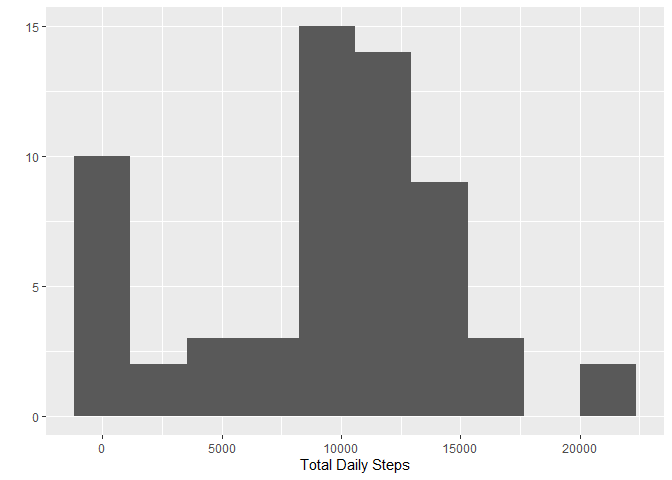
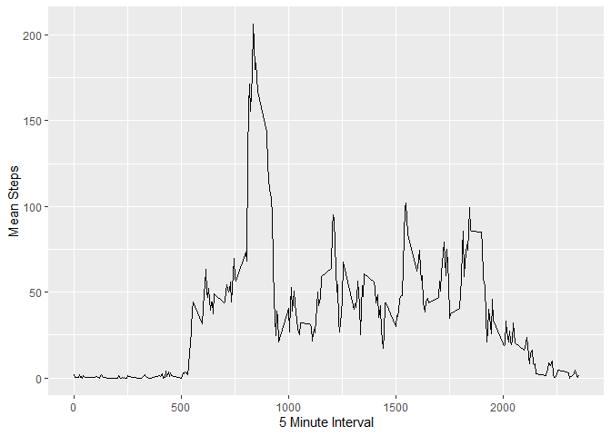
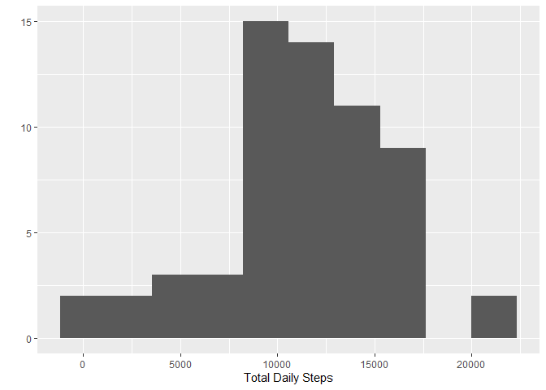
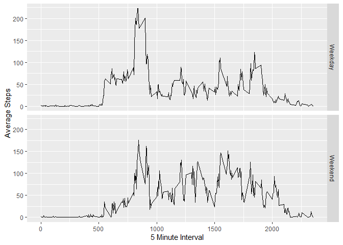

## Loading and preprocessing the data
1. Load the data.

```r
unzip("activity.zip")
mydt <- read.csv("activity.csv")
```


## What is mean total number of steps taken per day?
1. Calculate the total number of steps per day.

```r
sumdt <- mydt %>% group_by(date) %>% summarize(Total = sum(steps, na.rm = T))
```

2. Make a histogram

```r
qplot(sumdt$Total, xlab = "Total Daily Steps", bins = 10)
```

<!-- -->

3. Calculate and report the mean and median of the total number of steps taken per day

```r
mymean <- round(mean(sumdt$Total),3)
mymedian <- median(sumdt$Total)
```

The mean of the total daily steps equals 9354.23 and the median equals 10395.


## What is the average daily activity pattern?
1. Time series plot of average steps per each 5 minute interval.

```r
avedt <- mydt %>% group_by(interval) %>% summarize(mean = mean(steps, na.rm = T), sd = sd(steps, na.rm = T))
qplot(x = avedt$interval, y = avedt$mean, geom = "line", xlab = "5 Minute Interval", ylab = "Mean Steps")
```

<!-- -->

2. Find the interval with the maximum average of steps.

```r
mymax <- max(avedt$mean)
myintv <- avedt[avedt$mean == mymax,]$interval
```

The 5 minute interval which contains the maximum average steps is 835.


## Imputing missing values
1. Calculate and report the total number of missing values in the dataset.

```r
myNA <- sum(is.na(mydt$steps))
```

The total number of missing values equals 2304.


2. Devise a strategy for filling in all of the missing values in the dataset.

I decided to use the mean and SD of the corrosponding 5 minute interval to create a normal distribution from which to sample a random variable. If we generate a negative number, we will use 0 instead. While this might be too complicated, I thought it would be fun to code.

```r
mydt2 <- mydt
set.seed(123)
for (i in 1:nrow(mydt2)){
    if (is.na(mydt2[i,]$steps)){
        mydt2[[i,1]] <- rnorm(1, mean = avedt[avedt$interval == mydt2[i,]$interval,]$mean,
                        sd = avedt[avedt$interval == mydt2[i,]$interval,]$sd)
    }
}
mydt2[mydt2$steps < 0,]$steps <- 0
```

3. Make a histogram of the new data and compare to the old data.

```r
sumdt2 <- mydt2 %>% group_by(date) %>% summarize(Total = sum(steps, na.rm = T))
qplot(sumdt2$Total, xlab = "Total Daily Steps", bins = 10)
```

<!-- -->

```r
mymean2 <- round(mean(sumdt2$Total),3)
mymedian2 <- median(sumdt2$Total)

mymeanD <- abs(mymean - mymean2)
mymedianD <- abs(mymedian - mymedian2)
```

The mean of the total daily steps in the new data equals 11463.546, which is different from the old data by 2109.316. The median of the total daily steps in the new data equals 11458, which is different from the old data by 1063.


## Are there differences in activity patterns between weekdays and weekends?
1. Create new factor, 'weekday' or 'weekend'.

```r
mydt2$date <- as.Date(mydt2$date)
mydt2$daytype <- weekdays(mydt2$date)
wknd <- c("Saturday", "Sunday")
mydt2[mydt2$daytype %in% wknd,]$daytype <- "Weekend"
mydt2[!mydt2$daytype == "Weekend",]$daytype <- "Weekday"
mydt2$daytype <- as.factor(mydt2$daytype)
```

2. Make a panel plot containing a time series plot of the 5-minute interval and the average number of steps taken, averaged across all weekday days or weekend days.

```r
avedt2 <- mydt2 %>% group_by(daytype, interval) %>% summarize(mean = mean(steps, na.rm = T), .groups = "keep")
qplot(data = avedt2, x = interval, y = mean, facets = daytype ~ ., geom = "line",
      xlab = "5 Minute Interval", ylab = "Average Steps")
```

<!-- -->


